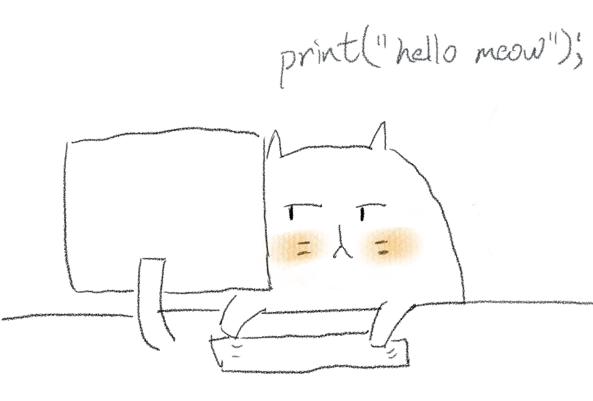

Hi, there. Thank you for your interest in this blog! It is awesome!   

I started this blog for my rekindled interest in ruby development, microservices deployment with kubernetes, and my new responsibility of managing a remote team. We have been using Node for the past few years.

This site is hosted with [GitHub Pages][github-pages]{:target="_blank"}, which is a wonderful free service for blogging or personal profile.  

You may find the source code of this site [here][site-repo]{:target="_blank"}.

If you find anything interesting or any mistake in the content, feel free to drop a comment on that page or create an issue [here][site-repo-issues]{:target="_blank"}.

Cheers,  
Billy Kong

[github-pages]: https://pages.github.com/
[site-repo]: https://github.com/billykong/billykong.github.io
[site-repo-issues]: https://github.com/billykong/billykong.github.io/issues